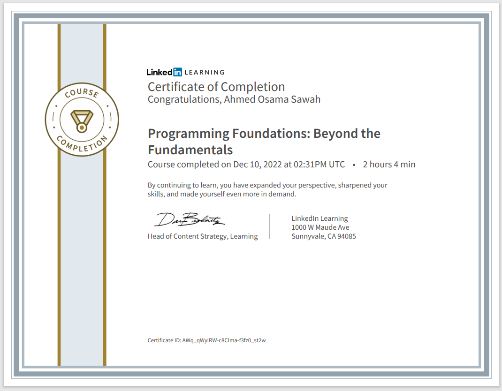

# Programming-foundations-Beyond-fundamentals

### Code Summary and Explanation

- [**Section 1:** Collections](./Code/01-Collection.py)
- [**Section 2:** Iteration](./Code/02-Iteraton.py)
- [**Section 3:** Work With Strings](./Code/03-working-With-Strings.py)
- [**Section 4:** Inputs And Outputs](./Code/04-Inputs-And-Outputs.py)
- [**Section 5:** Debugging ](./Code/05-Debugging.py)
- [**Section 6:** OOP ](./Code/06-OOP.py)

---

- [Challenges](./Challenges/readme.md)

---

### Course details

- Continue your coding journey as you dive deeper into the foundational concepts, practices, and terminology of programming. In this installment of the Programming Foundations series, instructor Sasha Vodnik goes beyond the basics, using Python to tackle a variety of intermediate and advanced concepts and skills you can add to your programming repertoire. Sasha covers creating and working with collections and loops, combining and manipulating strings, and using external code—all of which are critical concepts, regardless of which programming language you end up working with. He goes over several essential processes, such as choosing a code style and debugging. Plus, he digs into a few more advanced concepts, including memory management and multithreading.

---

- [Course Link](https://www.linkedin.com/learning/programming-foundations-beyond-the-fundamentals/?resume=false)

- [Preview Certificate](https://www.linkedin.com/learning/certificates/f469f2adfe153725a362252a3f2ada59e0f98c330eaa4f59aac7209618f7483c)

---
### [Back To Programming Foundation Course](../-01-Programming-Foundation-Fundamentals/readme.md)

### [Next To HTML And CSS Course](../../02-Udemy/01-HTML-CSS-Jonas/readme.md)
