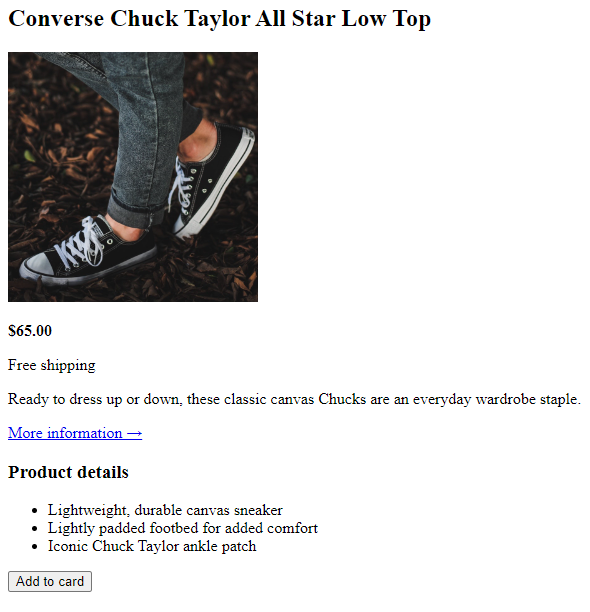
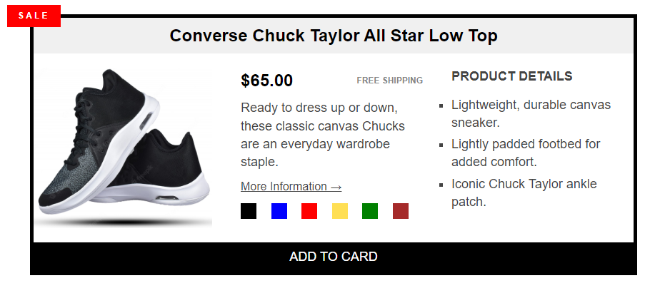

## Challenges

---

- [x] [Challenge #1](./01-Challenge/)
      

---

- [x] [Challenge #2](./02-Challenge/)
      

---

- [x] [Challenge #3](./03-Challenge/)
      

---

- [x] [Challenge #4](./04-Challenge/)
      

---

- [x] [Challenge #5](./05-Challenge_Float-Layouts/)
      

---

- [x] [Challenge #6](./06-Challenge_Flexbox-Layouts/)
      

---

- [x] [Challenge #7](./07-Challenge_CSS-Grid-Layouts/)
      

---

- [x] [Challenge #8](./08-Challange_Pagination-Compomnent/)
      

---

## [Back](../readme.md)