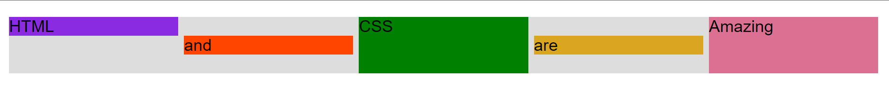
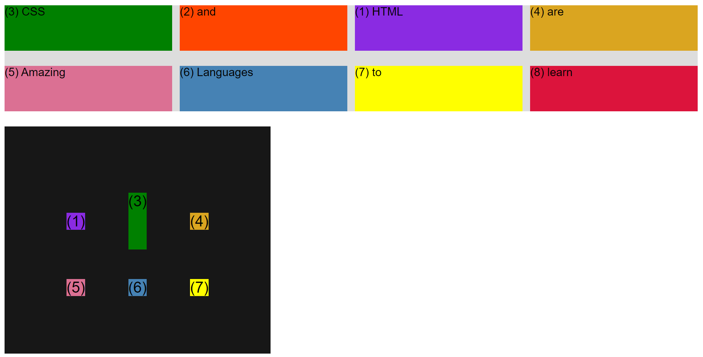

## CSS Layout Section Types:

## [01-Floats-Implementation](./Floats/index.html)

## [02-Flexbox-Implementation](./Flexbox/index.html)

## [Flexbox-Project](./Flexbox/Flexbox.html)

## [03-CSS-Grid-Implementation](./CSS-Grid/index.html)

## [CSS-Grid-Project](./CSS-Grid/CSS-Grid.html)

### [Back](../readme.md)
