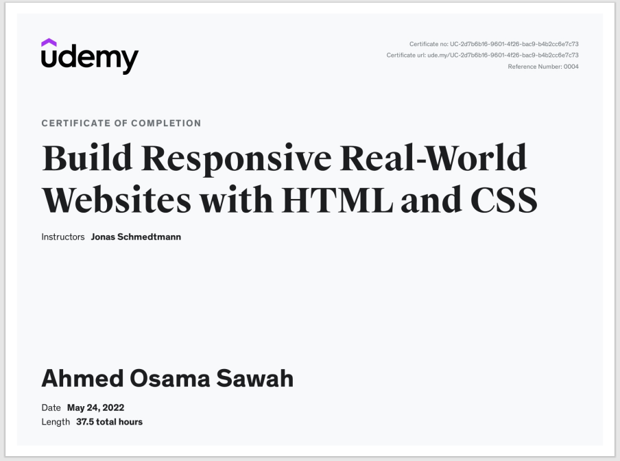

# Build Responsive Real-World Websites with HTML and CSS

- [Challenges](./Challenges/readme.md)

---

- [Course Code](./Code/readme.md)

### HTML

- [HTML Fundamentals](./Code/02-HTML-Fundamentals/)

### CSS

- [CSS Fundamentals](./Code/03-CSS-Fundamentals/)
- [CSS Layouts](./Code/04-CSS-Layouts/README.md)
- [CSS Designing](./Code/05-Design/)
- [CSS Components](./Code/06-Components/Code/readme.md)
- [Omnifood-v1](./Code/07-Omnifood-Desktop/)
- [Omnifood-v2](./Code/08-Omnifood-Responsive/)
- [Omnifood-v3](./Code/09-Omnifood-Optimizations/)

---

## Projects

### Omnifood

- [Project-code](./Projects/Omnifood)  
- [Live Demo](https://omnifood-blush.vercel.app/)

---

- [Course-Link](https://www.udemy.com/course/design-and-develop-a-killer-website-with-html5-and-css3) 

- [Certificate Link](https://www.udemy.com/certificate/UC-2d7b6b16-9601-4f26-bac9-b4b2cc6e7c73/)

---

### [Back To Beyond Fundamentals Course](../../01-Linkedin-Learning/-02-Programming-Foundations-Beyond-Fundamentals/readme.md)

### [Next To JavaScript Course](../02-JavaScript-Jonas/readme.md)
