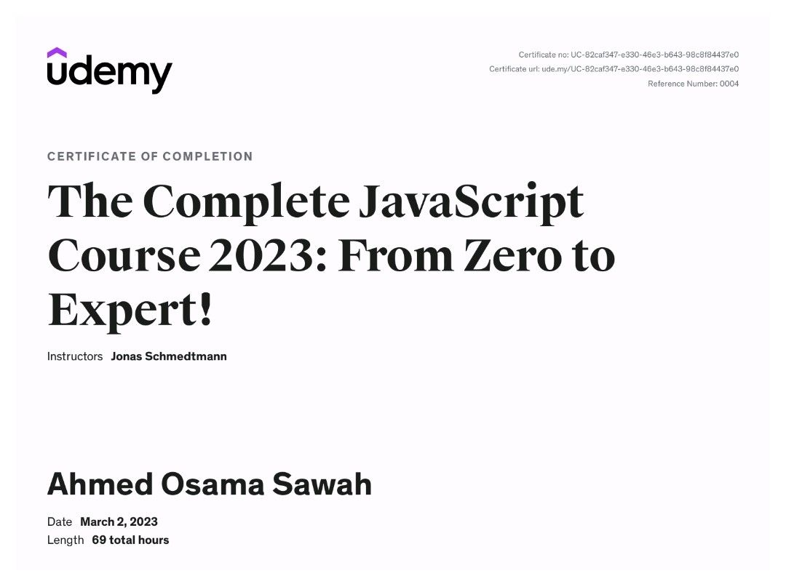

# The Complete JavaScript Course 2022: From Zero to Expert!

## Challenges

- [x] [JavaScript Fundamentals – Part 1 ](./Challenges/JavaScript%20Fundamentals%20–%20Part%201/readme.md)
- [x] [JavaScript Fundamentals – Part 2](./Challenges/JavaScript%20Fundamentals%20–%20Part%202/readme.md)
- [x] [Developer Skills & Editor Setup ](./Challenges/Developer%20Skills%20%26%20Editor%20Setup/readme.md)
- [x] [JavaScript in the Browser: DOM and Events](./Challenges/JavaScript%20in%20the%20Browser%20DOM%20and%20Events/readme.md)
- [x] [Data Structures, Modern Operators and Strings.](./Challenges/Data%20Structures%2C%20Modern%20Operators%20and%20Strings/readme.md)
- [x] [A Closer Look at Functions](./Challenges/A%20Closer%20Look%20at%20Functions/readme.md)
- [x] [Working With Arrays.](./Challenges/Working%20With%20Arrays/readme.md)
- [x] [Object Oriented Programming (OOP)](<./Challenges/Object%20Oriented%20Programming%20(OOP)/README.md>)
- [x] [Asynchronous JavaScript](./Challenges/Asynchronous%20JavaScript/readme.md)

---

## Course Code

- [Fundamentals 1](./Code/01-Fundamentals-Part-1/)
- [Fundamentals 2](./Code/02-Fundamentals-Part-2/)
- [Developer Skills](./Code/03-Developer-Skills/)
- [HTML CSS Fundamentals](./Code/04-HTML-CSS/)
- [Data Structure and operations](./Code/09-Data-Structures-Operators/)
- [How JS Works Behind the Scenes](./Code/08-Behind-the-Scenes/)
- [Closer Look at Functions](./Code/10-Functions/)
- [Arrays](./Code/11-Arrays-Bankist/)
- [Numbers, Date and Time](./Code/12-Numbers-Dates-Timers-Bankist/)
- [Dom Manipulation](./Code/13-Advanced-DOM-Bankist/)
- [Object Oriented Programming](./Code/14-OOP/)
- [Mapty and GeoLocation](./Code/15-Mapty/)
- [Async JavaScript](./Code/16-Asynchronous/)
- [JS Development](./Code/17-Modern-JS-Modules-Tooling/)
- [Final Project](./Code/18-Forkify/)

---

## Projects

### Pig Game

- [Project-code](./Code/07-Pig-Game/)
- [Live Demo](https://pig-game-tan.vercel.app/)

### Bankist

- [Project-code](./Code/11-Arrays-Bankist/)
- [Live Demo](https://bankist-jet.vercel.app/)

### Bankist v2

- [Project-code](./Code/12-Numbers-Dates-Timers-Bankist/)
- [Live Demo](https://bankist-v2.vercel.app/)

### Bankist Site

- [Project-code](./Code/13-Advanced-DOM-Bankist/)
- [Live Demo](https://bankist-web-site.vercel.app/)

### Mapty

- [Project-code](./Code/15-Mapty/)
- [Live Demo](https://github.com/ahmedosamasawah/MAPTY.git)

### Forkify

- [Project-code](./Code/18-Forkify/)
- [Live Demo](https://forkify-find-your-recepies.netlify.app/)

---

- [Course-Link](https://www.udemy.com/course/the-complete-javascript-course/)

- [Certificate Link](https://www.udemy.com/certificate/UC-82caf347-e330-46e3-b643-98c8f84437e0/)

---

### [Back To HTML and CSS Course](../01-HTML-CSS-Jonas/readme.md)

### [Next To 20 Vanilla JS Projects Course](../03-Vanilla-Web-Projects/readme.md)
