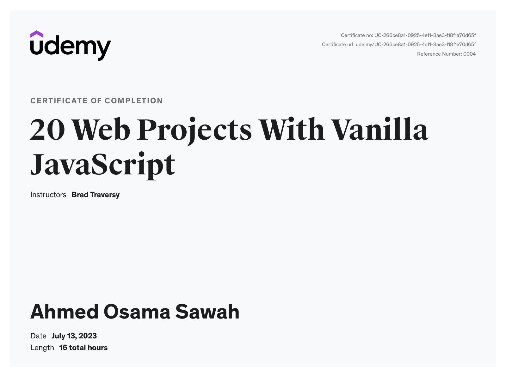

# 20+ Web Projects With Vanilla JavaScript

---

## Projects

|  #  |                                                       Project Code                                                       |                              Live Demo                               |
| :-: | :----------------------------------------------------------------------------------------------------------------------: | :------------------------------------------------------------------: |
| 01  |         [Form Validator](https://github.com/ahmedosamasawah/vanilla-js-20-projects/tree/main/01-Form-Validator/)         |       [Live Demo](https://form-validator-project.vercel.app/)        |
| 02  |     [Movie Seat Booking](https://github.com/ahmedosamasawah/vanilla-js-20-projects/tree/main/02-Movie-Seat-Booking/)     |     [Live Demo](https://movie-seat-booking-project.vercel.app/)      |
| 03  |    [Custom Video Player](https://github.com/ahmedosamasawah/vanilla-js-20-projects/tree/main/03-Custom-Video-Player/)    |       [Live Demo](https://custom-video-player-tan.vercel.app/)       |
| 04  |    [Exchange Rate Calculator](https://github.com/ahmedosamasawah/vanilla-js-20-projects/tree/main/04-Exchange-Rate/)     |       [Live Demo](https://exchange-rate-project.netlify.app/)        |
| 05  |  [DOM Array Methods Project](https://github.com/ahmedosamasawah/vanilla-js-20-projects/tree/main/05-DOM-Array-Methods/)  |     [Live Demo](https://dom-array-methods-project.netlify.app/)      |
| 06  |     [Menu Slider & Modal](https://github.com/ahmedosamasawah/vanilla-js-20-projects/tree/main/06-Modal-Menu-Slider/)     |     [Live Demo](https://menu-slider-modal-project.netlify.app/)      |
| 07  |             [Hangman Game](https://github.com/ahmedosamasawah/vanilla-js-20-projects/tree/main/07-Hangman/)              |      [Live Demo](https://hangman-vanilla-project.netlify.app/)       |
| 08  |          [Meal Finder App](https://github.com/ahmedosamasawah/vanilla-js-20-projects/tree/main/08-Meal-Finder/)          |    [Live Demo](https://meal-finder-vanilla-project.netlify.app/)     |
| 09  |        [Expense Tracker](https://github.com/ahmedosamasawah/vanilla-js-20-projects/tree/main/09-Expense-Tracker/)        |  [Live Demo](https://expense-tracker-vanilla-project.netlify.app/)   |
| 10  |           [Audio Player](https://github.com/ahmedosamasawah/vanilla-js-20-projects/tree/main/10-Audio-Player/)           |      [Live Demo](https://flourishing-genie-c52d96.netlify.app/)      |
| 11  |     [Infinite Scrolling](https://github.com/ahmedosamasawah/vanilla-js-20-projects/tree/main/11-Infinite-Scrolling/)     |     [Live Demo](https://infinite-scrolling-project.netlify.app/)     |
| 12  |             [Typing Game](https://github.com/ahmedosamasawah/vanilla-js-20-projects/tree/main/12-Type-Race/)             |         [Live Demo](https://type-race-project.netlify.app/)          |
| 13  |     [Speech Text Reader](https://github.com/ahmedosamasawah/vanilla-js-20-projects/tree/main/13-Speech-Text-Reader/)     | [Live Demo](https://speech-text-reader-vanilla-project.netlify.app/) |
| 14  |           [Memory Cards](https://github.com/ahmedosamasawah/vanilla-js-20-projects/tree/main/14-Memory-Cards/)           |        [Live Demo](https://memory-cards-project.netlify.app/)        |
| 15  |        [LyricsSearch App](https://github.com/ahmedosamasawah/vanilla-js-20-projects/tree/main/15-Lyrics-Search/)         |   [Live Demo](https://lyrics-search-vanilla-project.netlify.app/)    |
| 16  |              [Relaxer App](https://github.com/ahmedosamasawah/vanilla-js-20-projects/tree/main/16-Relaxer/)              |      [Live Demo](https://relaxer-vanilla-project.netlify.app/)       |
| 17  |            [Breakout Game](https://github.com/ahmedosamasawah/vanilla-js-20-projects/tree/main/17-Breakout/)             |      [Live Demo](https://breakout-vanilla-project.netlify.app/)      |
| 18  |     [New Year Countdown](https://github.com/ahmedosamasawah/vanilla-js-20-projects/tree/main/18-New-Year-Countdown/)     |     [Live Demo](https://new-year-countdown-project.netlify.app/)     |
| 19  |          [Sortable List](https://github.com/ahmedosamasawah/vanilla-js-20-projects/tree/main/19-Sortable-List/)          |       [Live Demo](https://sortable-list-project.netlify.app/)        |
| 20  | [Speak Number Guessing Game](https://github.com/ahmedosamasawah/vanilla-js-20-projects/tree/main/20-Speak-Number-Guess/) |     [Live Demo](https://speak-number-guess-project.netlify.app/)     |

---

- [Course-Link](https://www.udemy.com/course/web-projects-with-vanilla-javascript/) 

- [Certificate Link](https://www.udemy.com/certificate/UC-266ce8a1-0925-4ef1-8ae3-f18f1a70d65f/)

---

### [Back To JavaScript Course](../02-JavaScript-Jonas/readme.md)

### [Next To React JS Course](../04-React-JS-Maximilian/readme.md)
