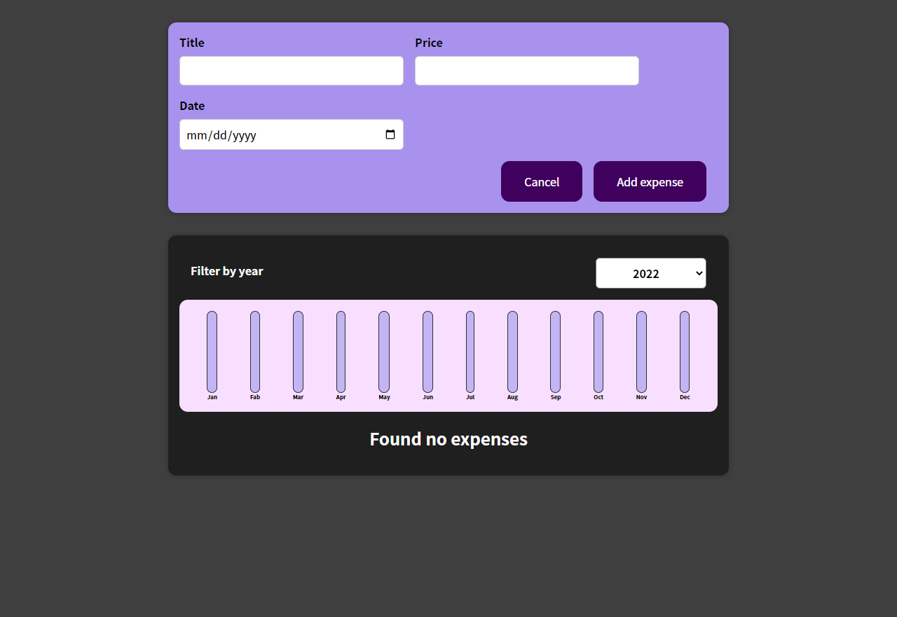
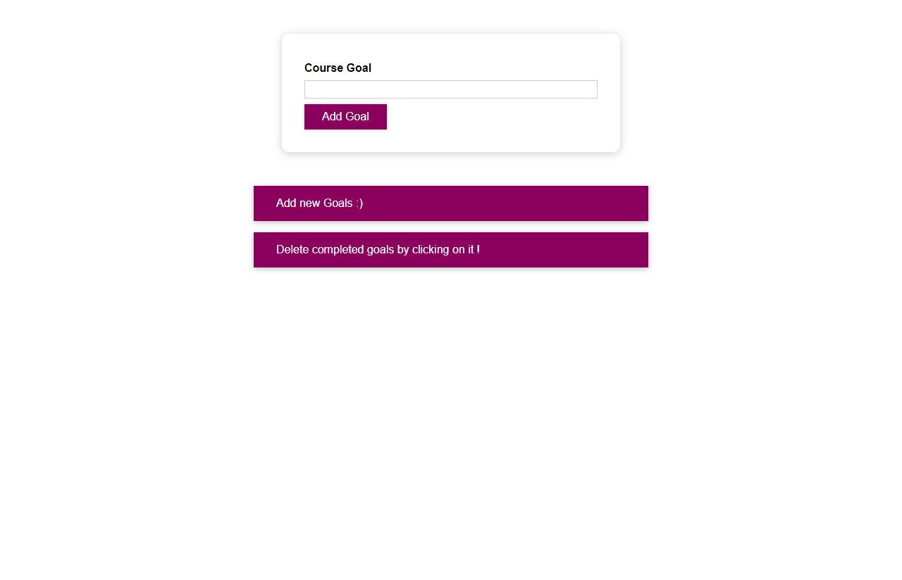

# React - The Complete Guide (incl Hooks, React Router, Redux)

### [Expenses App (S3-S5)](./01-Expenses-app/readme.md)

---

### [Goals App (S6-S7)](./02-goals-app/readme.md)

---

### Section 8-9 Project

- [Project-code](./03-section-8-9-project/Users-List-App/)
- [Live Demo](https://fake-form.vercel.app/)

---

### Login App (S10)

- [Project-code](./04-Login-app-s10/)
- [Live Demo](https://login-form-tau-puce.vercel.app/)

---

### [Order-Food App (S11)](./05-order-food-app/readme.md)

---

### Section 12 Project (Behind the scenes)

- [Project-code](./06-S12-project/React-behind-Scenes/)
- [Live Demo](https://section-12.vercel.app/)

---

### Section 13 Project (Class based components)

- [Project-code](./07-S13-project/Class-based-Components/)
- [Live Demo](https://section-13.vercel.app/)

---

### Movies App(S14)

- [Project-code](./08-movies-app/Connecting-to-Databases/)
- [Live Demo](https://movies-app-gold-mu.vercel.app/)

---

### Tasks app with firebase(S15)

- [Project-code](./09-task-app-firbase/10-Use-HTTP/)
- [Live Demo](https://tasks-app-eight.vercel.app/)

---

### Form App(S16)

- [Project-code](./10-form-app/11-React-Forms/)
- [Live Demo](https://form-app-tawny.vercel.app/)

---

### Order-food App (S17)

- [Project Code](./05-order-food-app/readme.md)
- [Final Project Live Live Demo](https://food-order-v2.vercel.app/)

---

### Redux Counter(S18)

- [Project-code](./11-redux-counter/12-React-Redux/)
- [Live Demo](https://redux-counter-xi.vercel.app/)

---

### Redux Cart(S19)

- [Project-code](./12-redux-cart/13-Advanced-Redux/)
- [Live Demo](https://redux-cart-ruddy.vercel.app/)

---

### Events App(S20, S21)

`React + Node`

- [Project-code](./13-events-app/react-router-project/)
- [Live Demo](https://events-frontend-two.vercel.app/)

---

### Blog(S22)

- [Project-code](./14-Blog/Blog-App/)
- [Live Demo](https://blog-taupe-seven-66.vercel.app/)

---

### Meetups app(S23)

- [Project-code](./15-meetups-app/project/)
- [Live Demo](https://meetsup-react-finall.vercel.app/)

---

### Animation-app (S24)

- [Project-code](./16-animation-app/project/)
- [Live Demo](https://animation-sepia.vercel.app/)

---

### Products-app(S25)

- [Project-code](./17-Products-app/products-app-project/)
- [Live Demo](https://products-app-lac.vercel.app/)

---

### todo-app-TS(S27)

- [Project-code](./18-todo-app-TS/todo-app/)
- [Live Demo](https://to-do-ts-ten.vercel.app/)

---

### ingredients-app(S28)

- [Project-code](./19-ingredients-app/ingredients-app/)
- [Live Demo](https://ingredients-2xwx.vercel.app/)

---

### React Poster(S29)

`React + Node`

- [Project-code](./20-react-poster/project/)
- [Live Demo](https://poster-react.vercel.app/)

---

### [Back](../readme.md)
