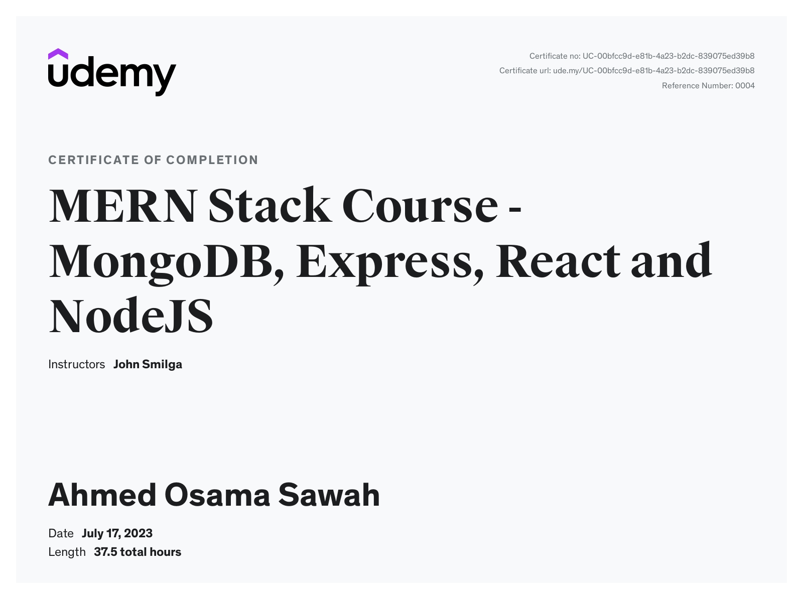

# MERN Stack Course 2023 - MongoDB, Express, React and NodeJS

### Jobify

- [Project-code](./Projects/Jobify/)  
- [Live Demo](https://jobify-juoh.onrender.com/)

---

- [Course-Link](https://www.udemy.com/course/mern-stack-course-mongodb-express-react-and-nodejs/) 
- [Certificate Link](https://www.udemy.com/certificate/UC-00bfcc9d-e81b-4a23-b2dc-839075ed39b8/)

---

### [Back To Node JS Course](../05-Node-js-Maximilian/readme.md)

### [Next To Serverless-Functions-Netlify Course](../../03-Serverless-Functions-Netlify/readme.md)
